# ECE_650 Project3: TCP Socket Programming

> **Guidance:**
>
> - [Beej's Guide to Network Programming](https://beej.us/guide/bgnet/)
>   - [Beej's Guide to Network Programming 简体中文版](https://beej-zhcn.netdpi.net/man/select)

2025/2/18-20

Sienna Zheng (NetID: sz318)

## Environment:

- C++
- Linux VM (duke vm)
- VS Code

## Introduction:

This project focuses on **TCP Socket Programming**, where students will develop a **multi-process application** simulating the **Hot Potato** game. The goal is to gain hands-on experience in **inter-process communication**, **network programming using TCP sockets**, and **process synchronization**.

The game involves:

1. A **ringmaster** process that initializes the game, sends a "potato" (data packet) to a randomly selected **player**, and monitors the game’s progress.
2. Multiple **player** processes arranged in a circular topology. Each player receives the potato, decrements a counter (number of hops), appends its ID to the potato, and forwards it to a randomly chosen neighbor.
3. The game ends when the hop count reaches **zero**, and the final player sends the potato back to the ringmaster, who then **prints the game trace** and shuts down all processes.

**Key Learning Objectives:**

- Setting up and managing **TCP socket connections**.
- Implementing a **client-server communication model**.
- Handling **command-line arguments and process execution**.
- Ensuring proper termination of **networked processes**.

## Project Model:

### Design Model:

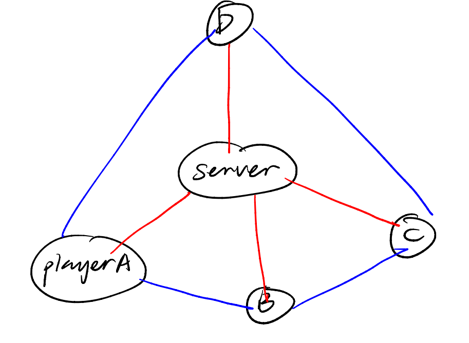

#### 1 Ringmaster:

- 1 listening socket `server_fd` 
  - Listen to all players’ TCP connection made by connect() (as all players get master’s hostname and port number when entering the program.)
- N TCP sockets:
  - each connect with a player
  - connect() by player
  - accept() by ringmaster

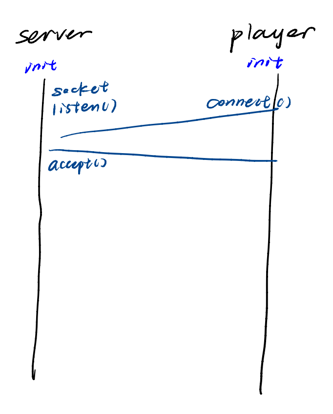

#### N Players, each has:

- 1 listening socket `player_listen_fd`
  - Listen to its left neighbor’s connect() (as ringmaster send each player its right neighbor’s listen_port)
- 3 TCP sockets:
  - 1 connect with ringmaster
  - 1 connect with left neighbor:
    - connect() by left neighbor
    - accept() by this player
  - 1 connect with right neighbor
    - connect() by this player
    - accept() by right neighbor

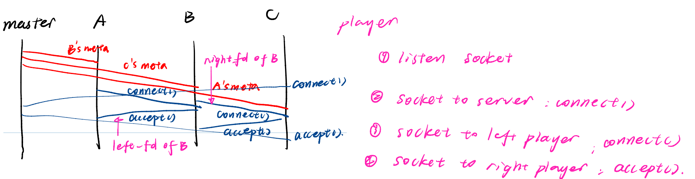

### Data Structure:

**Potato Class (`Potato.h`)**

- Represents the "hot potato" with:
  - `remainHops`: Remaining hops before the game ends.
  - `countHops`: Tracks total hops taken.
  - `path[MAX_TRACE_LEN]`: Stores player IDs in the hop sequence.
- Methods:
  - `addToPath(int player_id)`: Adds a player to the path.
  - `printPath()`: Prints the hop trace.

**Player Class (`Player.h`)**

- Represents a player with:
  - `fd`: File descriptor for communication to **ringmaster**.
  - `port`: **Listening** port of that player.
    - ringmaster needs to know each player’s listening port, so as to inform their left neighbor players how to connect to them.
  - `ip`: Player’s IP address.

**MetaInfo Class (`Player.h`)**

- Stores player network info (`ip`, `port`).

### Important Network Functions:

- `get_port(fd)`: Gets port from a socket using `getsockname()`.
- `init_server(port_name)`: Initializes a **TCP server**.
  - Ringmaster and all players may use this function to get a listening socket for themselves.

- `init_client(hostname, port_name)`:
  - Establish TCP connection with "server" by `connect()` to it, return client_fd.
  - Each player uses it twice:
    1. connect to ringmaster
    2. connect to its right neighbor

- `accept_connection(server_fd, client_ip)`: Accepts a client’s connection.
  - important function: `accept()` to accept a TCP connection.
  - Ringmaster uses it to connect to all players.
  - Each player also uses it to connect to its right neighbor.

### Programs:

#### Ringmaster:

- **Parse arguments**: `port_name`, `num_players`, `num_hops`.
- **Validate input**: Ensure `num_players > 1`, `0 <= num_hops <= 512`.
- **Setup network**: Create server socket (`init_server()`), accept players (`set_players()`).
- **Establish connections**: Send right neighbor info (`send_neighbor_info()`).
- **Start game**: Create `Potato`, send to a random player (`assign_potato()`).
- **Monitor game**: Use `select()` to track potato movement (`wait_end()`).
- **End game**: Notify players (`annouce_end()`), print potato trace, close connections (`close_all()`).

#### Player:

- **Parse arguments**: `hostname`, `port_name`.
- **Connect to ringmaster**: Create client socket (`init_client()`).
- **Receive player info**: Get `player_id`, `num_players`, setup listening socket (`connect_server()`).
- **Establish connections**: Connect to right neighbor, accept left neighbor (`connect_neighbor()`).
- **Play game**: Monitor messages (`receive_potato()`), handle potato movement (`toss_potato()`).
- **End game**: Notify ringmaster (`report_end()`), close connections (`close_player()`).

> **Why Two main Functions?**
> In this project, the ringmaster and the player are separate programs. Each program is compiled into its own executable, and each executable must have its own entry point (`main()`). The ringmaster acts as the server that accepts player connections and controls the game, while each player is a client that connects to the ringmaster and later communicates with other players.
> Therefore, they naturally have different `main()` functions because they perform different roles and are run separately.

## Test Result:

> Need to test more than 12 players to see if it has **sticky packet** problem. My design is fine with 12 players.

### Test1. 5 players [0…4] ，200 hops:

#### Ringmaster:

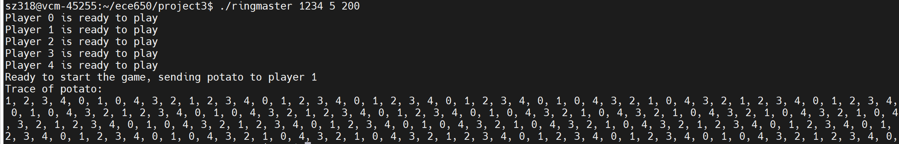

#### Player 0:

> with valgrind.

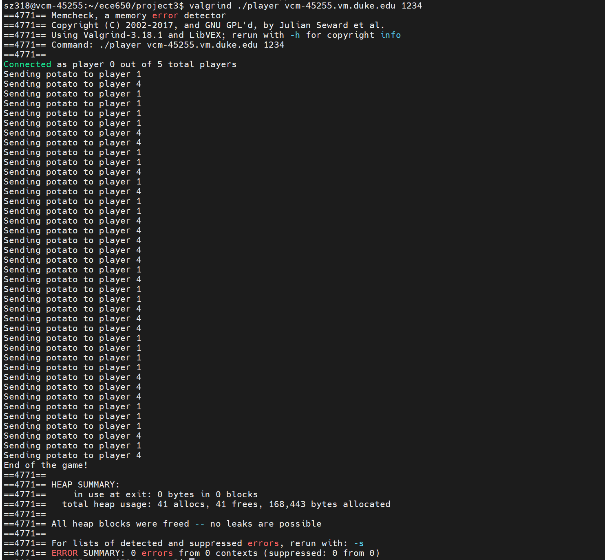

#### Player 1:

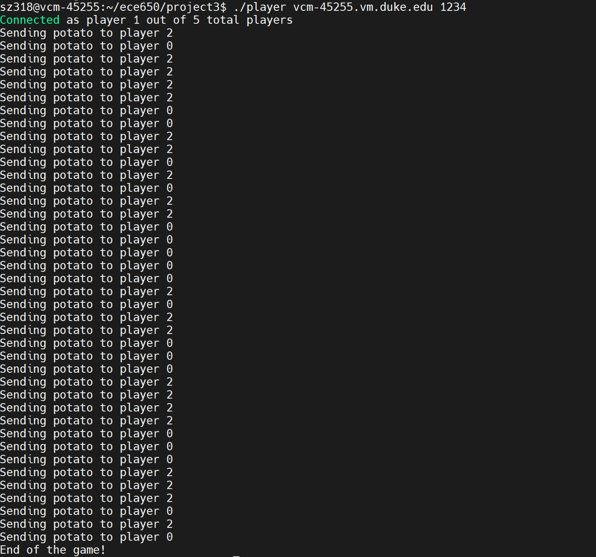

#### Player 2:

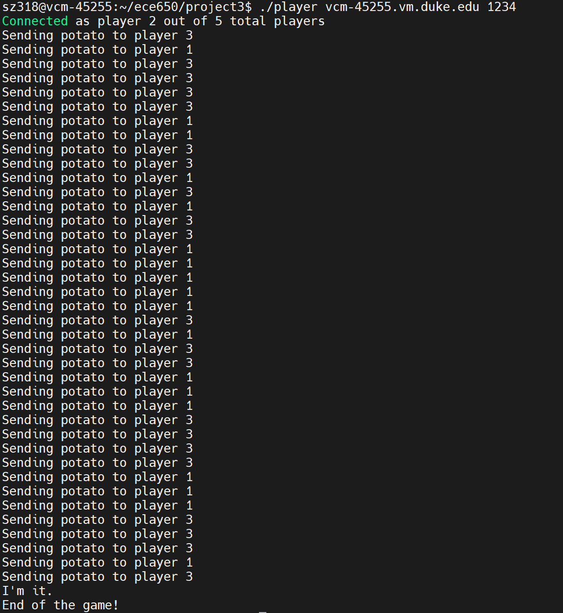

#### Player 3:

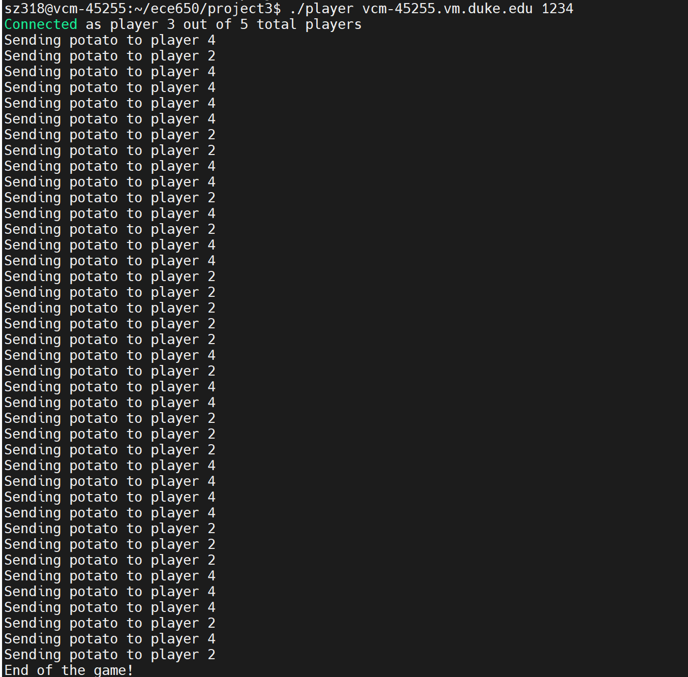

#### Player 4:

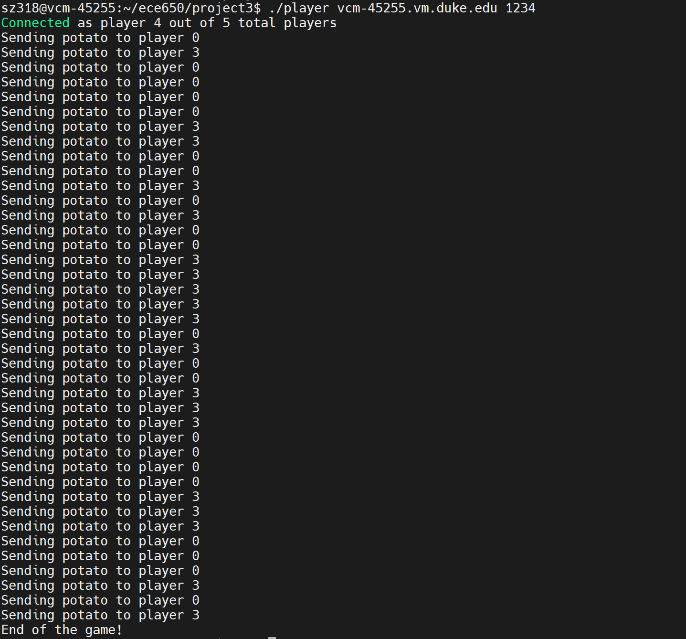

### Test2. 12 players [0…11], 200 hops:

#### Ringmaster:

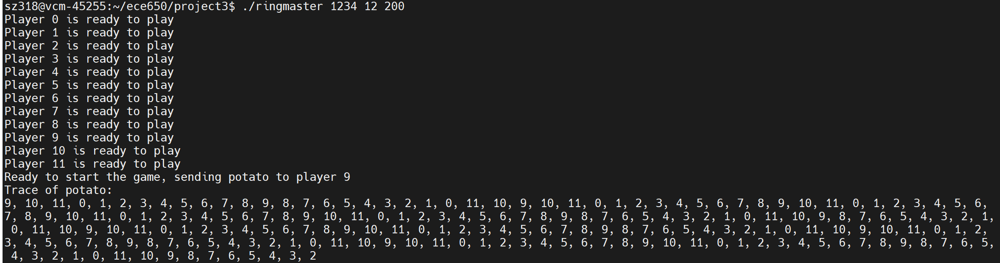

#### Players:

> just list 5 players here.

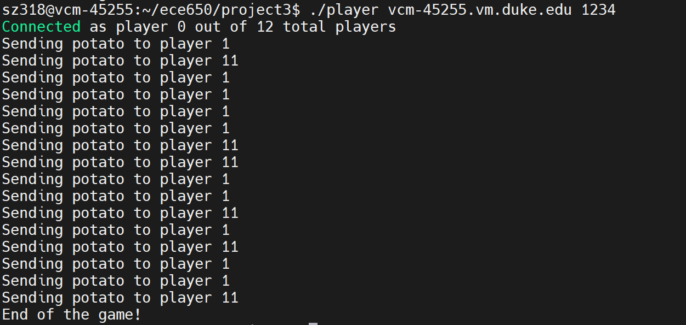

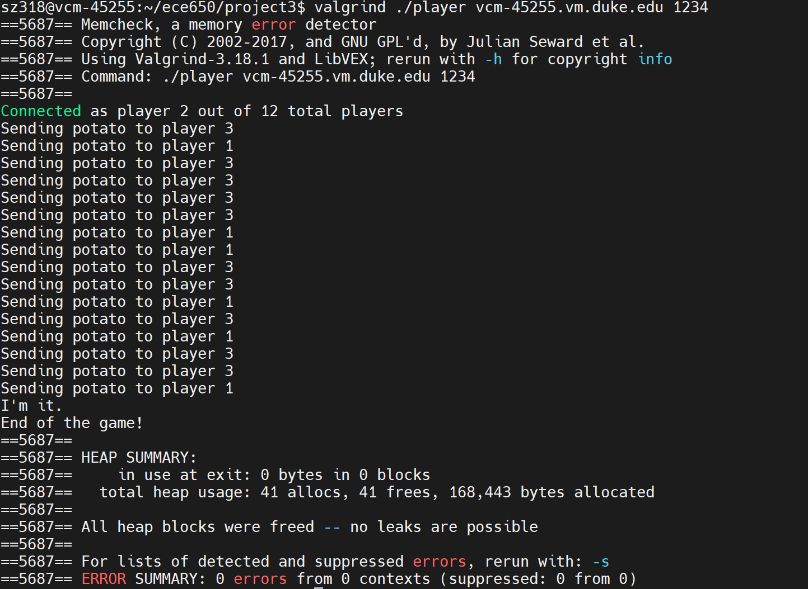

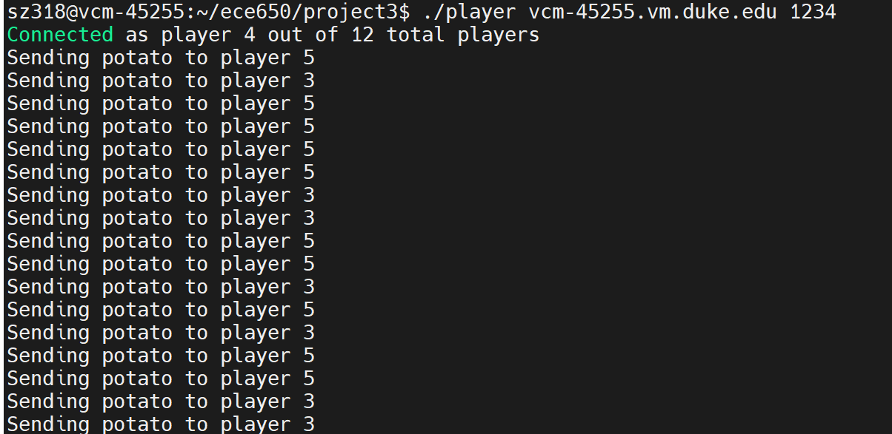

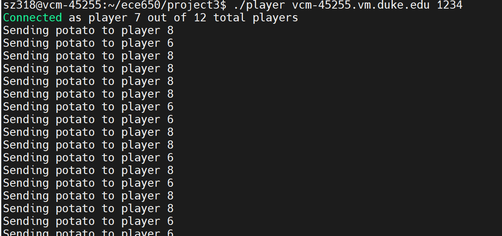

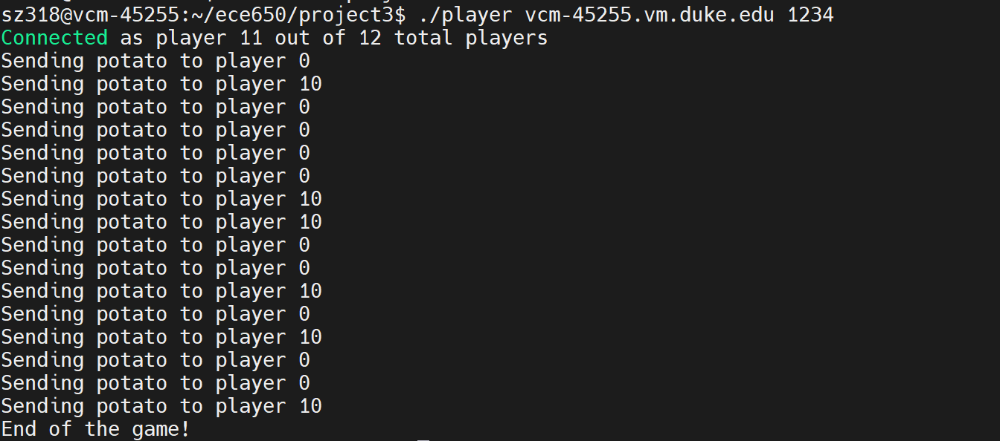

## Appendix: code

#### Makefile:

```makefile
CXX = g++
CXXFLAGS = -std=c++11 -Wall

TARGETS = ringmaster player

HEADERS = potato.hpp player.hpp network.hpp

all: $(TARGETS)

ringmaster: ringmaster.cpp $(HEADERS)
	$(CXX) $(CXXFLAGS) ringmaster.cpp -o ringmaster

player: player.cpp $(HEADERS)
	$(CXX) $(CXXFLAGS) player.cpp -o player

clean:
	rm -f $(TARGETS)

```

#### Headers:

##### potato.hpp:

```cpp
#ifndef POTATO_H
#define POTATO_H

#include <cstring>
#include <iostream>
using namespace std;


#define MAX_HOPS 512
#define MAX_TRACE_LEN (MAX_HOPS + 1)

class Potato
{
public:
  int remainHops; // number of remaining hops
  int countHops; // current counts of hops
  int path[MAX_TRACE_LEN];
public:
  Potato() : remainHops(0), countHops(0) {
    memset(path, 0, sizeof(path)); // set path[] to all 0
  }
  Potato(int remainHops) : remainHops(remainHops), countHops(0) {
    memset(path, 0, sizeof(path)); // set path[] to all 0
  }
  void printPath() {
    //cout << "countHop = " << countHops << endl;
    cout << "Trace of potato:" << endl;
    string split = ",";
    for (int i = 0; i < countHops; ++i) {
      cout << path[i] << split;
    }
    cout << endl;
  }

  void addToPath(int player_id) {
    if (countHops < MAX_TRACE_LEN) {
        path[countHops] = player_id;
        ++countHops;
    } else {
        // We are out of space -- handle error or ignore
        std::cerr << "Error: path array is full! Cannot add more players.\n";
    }
  }
};


#endif
```

##### network.hpp:

```cpp
#ifndef NETWORK_H
#define NETWORK_H

#include <cstring>
#include <iostream>
#include <netdb.h>
#include <arpa/inet.h>
using namespace std;


/**
 * Get client's port number
 */
int get_port(int fd) {
    struct sockaddr_in addr;
    socklen_t addr_len = sizeof(addr);
    if (getsockname(fd, (struct sockaddr *)&addr, &addr_len) == -1) {
        perror("getsockname");
        // handle error
    }
    int local_port = ntohs(addr.sin_port);
    return local_port;  
}

/**
 * Listening for a client's connection request from server_fd. 
 * Server accepts connection and returns client_fd. TCP connection is build since.
 * accept() prototype: int accept(int s, struct sockaddr *addr, socklen_t *addrlen);
 * accept() returns a new socket descriptor for requests coming from listening socket
 */
int accept_connection(int server_fd, string &client_ip) {
    struct sockaddr_storage client_addr;
    socklen_t addr_size = sizeof(client_addr);
    int client_fd = accept(server_fd, (struct sockaddr*)&client_addr, &addr_size);
    if (client_fd == -1) {
        perror("accept");
        exit(EXIT_FAILURE);
    }

    // TODO
    // client_ip = "client_ip_placeholder";
    struct sockaddr_in *temp = (struct sockaddr_in *)&client_addr;
    client_ip = inet_ntoa(temp->sin_addr);
    return client_fd;
}

/**
 * create a listening socket, accept message from any other ports
 */
int init_server(const char *port_name) {
    // hints: tell getaddrinfo() what kind of info we want
    struct addrinfo hints, *res;
    int listen_fd;

    // 1. get address info by calling getaddrinfo()
    memset(&hints, 0, sizeof hints);
    hints.ai_family = AF_UNSPEC;       // IPv4 or IPv6
    hints.ai_socktype = SOCK_STREAM;   // TCP, reliable (UDP: SOCK_DGRAM)
    hints.ai_flags = AI_PASSIVE;       // fill in automatically with the IP addr of my computer
    if (getaddrinfo(NULL, port_name, &hints, &res) != 0) {
        cerr << "getaddrinfo error." << endl;
        exit(EXIT_FAILURE);
    }

    // 2. get a new socket fd for listening socket by calling socket()
    listen_fd = socket(res->ai_family, res->ai_socktype, res->ai_protocol);
    if (listen_fd == -1) {
        perror("socket");
        exit(EXIT_FAILURE);
    }

    // 3. socket settings
    int optval = 1; // socket setting: SO_REUSEADDR(1) is true
    if (setsockopt(listen_fd, SOL_SOCKET, SO_REUSEADDR, &optval, sizeof optval)) {
        perror("setsockopt");
        exit(EXIT_FAILURE);
    }

    // 4. bind a socket to a specifc port# on a specific machine (IP addr.)
    // int bind(int sockfd, struct sockaddr *my_addr, socklen_t addrlen);
    if (bind(listen_fd, res->ai_addr, res->ai_addrlen) == -1) {
        perror("bind");
        exit(EXIT_FAILURE);
    }

    // 5. release res memory
    freeaddrinfo(res);    

    // 6. listen for requests from any other hosts
    if (listen(listen_fd, 100) == -1) { // backlog = 100
        cerr << "Error: cannot listen on socket" << endl; 
        // cerr << "  (" << hostname << "," << port << ")" << endl;
        return -1;
    } 

    return listen_fd;
}


/**
 * Establish TCP connection with "server" by connect() to it, return client_fd
 */
int init_client(const char* hostname, const char* port_name) {
    struct addrinfo hints, *res;
    memset(&hints, 0, sizeof(hints));
    hints.ai_family = AF_UNSPEC;       // Support both IPv4 and IPv6
    hints.ai_socktype = SOCK_STREAM;   // TCP

    // get master's ip addr.etc so as to connect to it
    if (getaddrinfo(hostname, port_name, &hints, &res) != 0) {
        cerr << "getaddrinfo error." << endl;
        exit(EXIT_FAILURE);
    }
    
    int socket_fd = socket(res->ai_family, res->ai_socktype, res->ai_protocol);
    if (socket_fd == -1) {
        perror("socket");
        exit(EXIT_FAILURE);
    }

    // connect to server
    if (connect(socket_fd, res->ai_addr, res->ai_addrlen) == -1) {
        perror("Failed to connect to server");
        exit(EXIT_FAILURE);
    }

    freeaddrinfo(res);
    return socket_fd;
}

#endif
```

##### player.hpp:

```cpp
#ifndef PLAYER_H
#define PLAYER_H

#include <string>
#include <string.h>
using namespace std;
class Player {
public:
    int fd;     // fd to master
    int port;   // listen port
    string ip;
public:
    Player() : fd(0), port(0), ip("") {}
    Player(int fd, int port, string ip) : fd(fd), port(port), ip(ip) {}
};

class MetaInfo {
public:
  char ip[100];
  int port;
  MetaInfo() : port(-1) {
    memset(ip, 0, sizeof(ip));
  }
};

#endif
```

#### Cpp:

##### ringmaster.cpp:

```cpp
#include <stdio.h>
#include <stdlib.h>
#include <string.h>
#include <unistd.h>
#include <netdb.h>
#include <vector>
#include <sys/types.h>
#include <sys/select.h>
#include <sys/socket.h>
#include <netinet/in.h>
#include <arpa/inet.h>
#include "potato.hpp"
#include "player.hpp"
#include "network.hpp"
#include <time.h>
#include <sys/select.h>
#include <cassert>

void report_error(string msg) {
    cerr<< "Error: " << msg << endl;
}


/**
 * Set up for all players and fill in the vector<Player> and conncet to server with player_port
 * send() prototype: ssize_t send(int socket_fd, const void *buf, size_t len, int flags);
 */
void set_players(int server_fd, int num_players, vector<Player>& player_list) {
    for (int i = 0 ; i < num_players; ++i) {
        int player_port; // player to server connection
        string player_ip;
        int p_fd, p_port;
        string p_ip;
        p_fd = accept_connection(server_fd, player_ip);
        p_ip = player_ip;
        // server send player's index(id) to player's socket
        send(p_fd, &i, sizeof(i), 0); // 0 - normal message
        // server send players' number to player's socket
        send(p_fd, &num_players, sizeof(num_players), 0);
        // receive the port_num for current player to listen to its neighbor
        // TODO : 0 ? WAITALL?
        recv(p_fd, &player_port, sizeof(player_port), MSG_WAITALL);
        p_port = player_port;
        Player p(p_fd, p_port, p_ip);
        player_list.push_back(p);
        //print message
        cout << "Player " << i << " is ready to play" << endl;
        //cout << "Info of Player " << i << ": ip:" << p_ip << "  fd: " << p_fd << "  port: " << p_port << endl;
    }
}

void print_player_list(vector<Player>& player_list) {
    cout << "Player list: " << endl;
    int n = player_list.size();
    for (int i = 0; i < n; ++i) {
        cout << "Player " << i << "  port: " << player_list[i].port <<
        "   fd: " << player_list[i].fd << "   ip: " << player_list[i].ip << endl;
    }
}

/**
 * Form the ring among players: 
 * Ringmaster send each player their right neighbor's info
 * While: (int player.cpp) each player listen to its right neighbor 
 * on its player_listen_fd, then set up their TCP connection
 */
void send_neighbor_info(vector<Player>& player_list) {
    int n = player_list.size();
    for (int i = 0; i < n; ++i) {
        int next_id = (i + 1) % n;
        MetaInfo meta_info;
        meta_info.port = player_list[next_id].port;
        strcpy(meta_info.ip, (player_list[next_id].ip).c_str());
        send(player_list[i].fd, &meta_info, sizeof(meta_info), 0);
    }
}

/**
 * TCP connection setup:
 * 1. client request a connection to server by connect()
 * 2. server accepts a connection from client by accept()
 * TCP connection close:
 * 1. BOTH sides should eventually close their own socket file 
 *    descriptors when they no longer need the connection.
 */

/**
 * Toss the potato to a random player in the beginning
 */
void assign_potato(Potato& potato, vector<Player>& player_list) {
    int n = player_list.size();
    // get a random seed at the beginning of the program to make 
    // sure everytime we have different random sequence
    srand((unsigned int)time(NULL)); 
    int rand_index = rand() % n; // [0, n)
    cout << "Ready to start the game, sending potato to player " << rand_index << endl;
    // return value of send() is the number of bytes it sends. -1: error; < len: broken
    if (send(player_list[rand_index].fd, &potato, sizeof(potato), 0) != sizeof(potato)) {
        cout << "The potato is broken!" << endl;
    }
}

/**
 * Announce the end of the game to all players by sending them ending message msg
 */
void annouce_end(vector<Player>& player_list, Potato& p) {
    for (int i = 0; i < player_list.size(); ++i) {
        send(player_list[i].fd, &p, sizeof(p), 0);
    }
}


/**
 * select() prototype: 
 * int select(int n, fd_set *readfds, fd_set *writefds, fd_set *exceptfds, struct timeval *timeout);
 * n is the max socket_fd + 1
 * return value: 1.success: |fd_set|; 2. timeout: 0; 3. error: -1
 */
void wait_end(vector<Player>& player_list, Potato& potato) {
    fd_set readfds;
    FD_ZERO(&readfds);
    int max_fd = -1;
    for (size_t i = 0; i < player_list.size(); i++) {
        FD_SET(player_list[i].fd, &readfds);
        if (player_list[i].fd > max_fd) {
            max_fd = player_list[i].fd;
        }
    }
    int status = select(max_fd + 1, &readfds, NULL, NULL, NULL);
    if (status < 0) {
        perror("select");
        exit(EXIT_FAILURE);
    }

    // traverse all players, find the one ends the game
    for (size_t i = 0; i < player_list.size(); i++) {
        if (FD_ISSET(player_list[i].fd, &readfds)) {
            int n = recv(player_list[i].fd, &potato, sizeof(potato), MSG_WAITALL);
            if (n != sizeof(potato)) {
                perror("recv");
                exit(EXIT_FAILURE);
            }
            break;
        }
    }
}

/**
 * Close all TCP connection by close() sockets
 * close() prototype: int close(int s);
 */
void close_all(int server_fd, vector<Player>& player_list) {
    for (int i = 0; i < player_list.size(); ++i) {
        close(player_list[i].fd);
    }
    close(server_fd);
}


/**
 * 1.Establish N network socket connections with N number of players and provide relevant 
 * information to each player (see Communication Machanism section below for details) 
 * 2. Create a "potato" object as described above 
 * 3. Randomly select a player and send the "potato" to the selected player 
 * 4. At the end of the game (when the ringmaster receive the potato from the player who 
 * is "it"), print a trace of the potato to the screen.
 * 5. Shut the game down by sending a message to each player
 */
int main(int argc, char *argv[]) {
    if (argc != 4) {
        fprintf(stderr, "Usage: %s <port_num> <num_players> <num_hops>\n", argv[0]);
        exit(1);
    }
    
    const char *port_name = argv[1];
    int num_players = atoi(argv[2]);
    int num_hops = atoi(argv[3]);

    if (num_players <= 1 || num_hops < 0 || num_hops > 512) {
        fprintf(stderr, "Invalid arguments.\n");
        exit(1);
    }

    cout << "Potato Ringmaster" << endl;
    cout << "Players = " << num_players << endl;
    cout << "Hops = " << num_hops << endl;
    // TODO: check validity

    /* 1. Establish network with players and set them up */
    // create a server socket to listen to requests from any port
    int server_fd = init_server(port_name);
    // build TCP connection with players and set up all players
    vector<Player> player_list;
    set_players(server_fd, num_players, player_list);
    // print_player_list(player_list);
    // players build TCP connection with its left and right neighbors
    send_neighbor_info(player_list);

    /* 2. Create a "potato" object */
    Potato potato(num_hops);
    if (num_hops <= 0) {
        cout << "Game exits because of <= 0 nums of hops!" << endl;
        return EXIT_SUCCESS;
    }
    // cout << "Potato created successfully with hop number of " << potato.remainHops << endl;

    /* 3. send the potato to a random player */
    assign_potato(potato, player_list);

    // TODO: wait for mesg from player
    wait_end(player_list, potato);
    /* 5. annouce end of the game to all players */
    assert(potato.remainHops == 0);
    annouce_end(player_list, potato);
    potato.printPath();
    close_all(server_fd, player_list);

    return EXIT_SUCCESS;
}
```

##### player.cpp:

```cpp
#include <iostream>
#include <string>
#include <cstring>
#include <cstdlib>
#include <unistd.h>
#include <netdb.h>
#include <sys/socket.h>
#include <arpa/inet.h>
#include <sys/select.h>
#include <cassert>
#include "potato.hpp"
#include "player.hpp"
#include "network.hpp"

/** player_listen_fd must be reference here. so that it can pass the value 
 *  generated by init() to main()
 */
void connect_server(int player_fd, int& player_listen_fd, int& player_id, int& num_players) {
    MetaInfo meta;
    recv(player_fd, &player_id, sizeof(player_id), 0);
    recv(player_fd, &num_players, sizeof(num_players), 0);
    std::cout << "Connected as player " << player_id << " out of " << num_players << " total players" << std::endl;
    // send port number of player's listen socket!!! to ringmaster
    // this is used for other players to connect to this player
    // passing an empty string ("") or NULL as the service/port tells the system to use an ephemeral port
    player_listen_fd = init_server("");
    int player_listen_port = get_port(player_listen_fd);
    send(player_fd, &player_listen_port, sizeof(player_listen_port), 0);
}

void neighbor_test(int left_fd, int right_fd, int player_id) {
    int left_id, right_id;
    // connection test to left neighbor
    send(right_fd, &player_id, sizeof(player_id), 0); // send message to my right
    recv(left_fd, &left_id, sizeof(left_id), 0); // my left send me message
    // connection test to left neighbor
    send(left_fd, &player_id, sizeof(player_id), 0);
    recv(right_fd, &right_id, sizeof(right_id), 0);
    cout << "left neighbor id: " << left_id << "; right neighbor id: " << right_id << endl;
}

/**
 * Establish TCP connection with left neighbor
 */
void connect_neighbor(int player_fd, int listen_fd, int& left_fd, int& right_fd, int player_id) {
    MetaInfo meta;
    // receive right neighbor info from ring master
    recv(player_fd, &meta, sizeof(meta), 0);
    // cout << "Neighbor Info: port: " << meta.port << "   ip:" << meta.ip << endl;

    right_fd = init_client(meta.ip, to_string(meta.port).c_str());
    // cout << "Connect to right neighbor." << endl;

    // accept() connection from left player
    string left_ip;
    left_fd = accept_connection(listen_fd, left_ip);
    // cout << "Connection established with left player ip: "  << left_ip << endl;
    // neighbor_test(left_fd, right_fd, player_id);
}

/**
 * Randomly toss potato to left / right player
 */
void toss_potato(Potato& p, int socket_fd, int neigbor_id) {
    send(socket_fd, &p, sizeof(p), 0);
    std::cout << "Sending potato to " << neigbor_id << std::endl;
}

/**
 * Inform ringmaster end of the game when remainHops == 0
 * and annouce "I'm it"
 */
void report_end(Potato& p, int player_fd, const char* announcement) {
    send(player_fd, &p, sizeof(p), 0);
    cout << announcement << endl;
}

/**
 * Deal with potato:
 * 1. Add current player_id to path
 * 2. Randomly toss potato to left / right player
 * 3. Decrease remainingHops, if = 0, inform ringmaster
 */
void deal_with_potato(Potato& p, int player_fd, int left_fd, int right_fd, int player_id, int num_players) {
    assert(p.remainHops > 0);
    --p.remainHops; // need to do decrease before toss, so as to give neighbor the right value
    p.addToPath(player_id);
    // p.printPath();
    if (p.remainHops == 0) {
        report_end(p, player_fd, "I'm it");
        return;
    }
    
    int random = rand() % 2;
    if (random == 0) {
        toss_potato(p, left_fd, (player_id - 1 + num_players) % num_players);
    } else {
        toss_potato(p, right_fd, (player_id + 1) % num_players);
    }
}

/** 
 * Potato can be received from: 
 * 1.ring master (through player_fd);
 * 2.left neighbor (through left_fd);
 * 3.right neighbor (through right_fd).
 * Player'll be looping to listen for these msgs until master send the end signal
 * Player'll need to send end msg to master when remainHop = 0.
 * select() prototype: int select(int n, fd_set *readfds, fd_set *writefds, 
 *                     fd_set *exceptfds, struct timeval *timeout);
 */
void receive_potato(int player_fd, int left_fd, int right_fd, int player_id, int num_players) {
    Potato potato;
    // recv(player_fd, &potato, sizeof(potato), 0);

    int max_fd = max(player_fd, max(left_fd, right_fd));
    while (true) {
        // select(): check player_fd, left_fd, right_fd at the same time
        fd_set readfds;
        // clear set every loop and re-initialize it
        FD_ZERO(&readfds);
        // add fds to set
        FD_SET(player_fd, &readfds);
        FD_SET(left_fd, &readfds);
        FD_SET(right_fd, &readfds);     
        int status = select(max_fd + 1, &readfds, NULL, NULL, NULL);
        int has_msg = 0;
        if (status == -1) {
           perror("select"); 
           exit(EXIT_FAILURE);
        } else if (status == 0) {
            cout << "Timeout occurred! No data has received!" << endl;
        } else { // at least one recv()
        // can only handle one recv() at a time
            if (FD_ISSET(left_fd, &readfds)) {
                has_msg = recv(left_fd, &potato, sizeof(potato), MSG_WAITALL);
                // cout << "Recieving the potato from left neighbor." << endl;
            } else if (FD_ISSET(right_fd, &readfds)) {
                has_msg = recv(right_fd, &potato, sizeof(potato), MSG_WAITALL);
                // cout << "Recieving the potato from right neighbor." << endl;
            } else if (FD_ISSET(player_fd, &readfds)) {
                has_msg = recv(player_fd, &potato, sizeof(potato), MSG_WAITALL);
                // cout << "Recieving the potato from master." << endl;
            }
            if (has_msg == -1) {
                perror("receive");
                exit(EXIT_FAILURE);
            } else if (has_msg == 0) { // the remote side has closed the connection
                // cout << "Connection closed. Exiting loop." << endl;
                // cout << "End of the game!" << endl;
                break;
            } else if (potato.remainHops == 0) { // receive ending signal
                // cout << "End of the game!" << endl;
                break;
            } else {
                deal_with_potato(potato, player_fd, left_fd, right_fd, player_id, num_players);
            }
        }
    }
}

/**
 * Close listen_fd, left_fd, right_fd
 */
void close_player(int left_fd, int right_fd, int listen_fd) {
    close(left_fd);
    close(right_fd);
    close(listen_fd);
}

/**
 * 1. Establish TCP connection with ringmaster
 * 2. Recieve player info from ringmaster
 * 3. Receive neighbor info from ringmaster and establish p2p connection to neighbor
 * 4. Play the game
 * 5. Close socket to end the connection
 */
int main(int argc, char *argv[]) {
    if (argc != 3) {
        cerr << "Usage: " << argv[0] << " <machine_name> <port_num>" << endl;
        exit(EXIT_FAILURE);
    }

    const char* hostname = argv[1]; // ringmaster's hostname
    const char* port_name = argv[2];     // ringmaster's port number

    // 1. Establish a TCP connection to the ringmaster
    int player_fd = init_client(hostname, port_name);
    // 2. Generate listen socket and send listen port to ringmaster
    int player_listen_fd;
    int player_id, num_players;
    connect_server(player_fd, player_listen_fd, player_id, num_players);
    // 3. Connect to neighbors
    int left_fd, right_fd; // fd of TCP connection to left, right neighbor
    connect_neighbor(player_fd, player_listen_fd, left_fd, right_fd, player_id);
    // 4. Play the game
    receive_potato(player_fd, left_fd, right_fd, player_id, num_players);
    // 5. Close player's fd: listen_fd, left_fd, right_fd 
    // (fd to ringmaster will be closed by ringmaster)
    close_player(left_fd, right_fd, player_listen_fd);
    
    return EXIT_SUCCESS;
}
```


